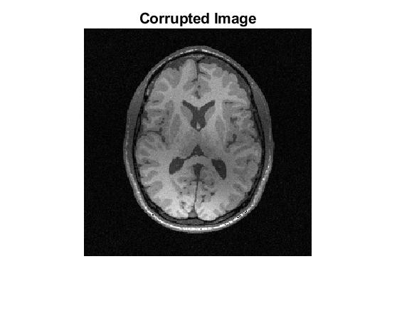
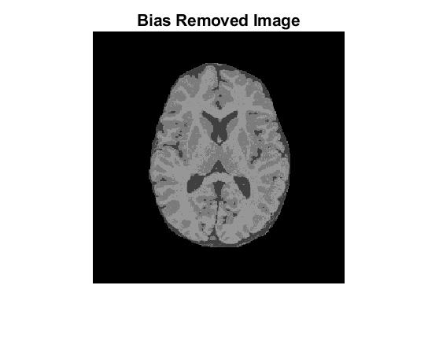
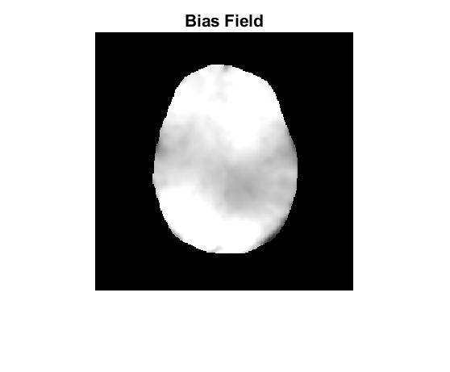
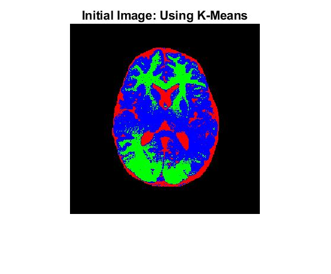
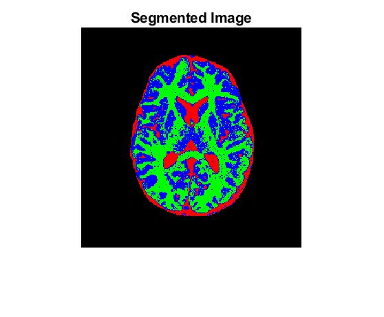

<h1 align="center">Segmentation using FCM with Bias Field Correction</h1>

A modified *Fuzzy-C-Means* (FCM) approach to segment an image while estimating and accounting for the bias/inhomogeneity field.     

</img>

  </img>
</img>

 

</img>

</img>

 

## Usage:
See [`code/main.mlx`](code/main.mlx) and run it cell by cell.

## Documentation:
- [`code/main.mlx`](code/main.mlx): The main script/driver program
- [`code/computeA.m`](code/computeA.m): Computes the bias-removed image
- [`code/distance.m`](code/distance.m): Computes the "distance" values used in `updateU.m`
- [`code/iterate.m`](code/iterate.m): Driver class for the algorithm
- [`code/KMeans.m`](code/KMeans.m): Returns the initial segmentation using the standard K-means algorithm
- [`code/objectiveFunction.m`](code/objectiveFunction.m): Evaluates the objective function at the current estimates
- [`code/showSegmented.m`](code/showSegmented.m): Plots the segmented image using a custom colormap
- [`code/updateB.m`](code/updateB.m): Computes the optimal value of the bias field, within every iteration.
- [`code/updateC.m`](code/updateC.m): Computes the optimal value of the class means, within every iteration.
- [`code/updateU.m`](code/updateU.m): Computes the optimal value of the class memberships, within every iteration.

---

*(This was done as a course assignment for CS736: Medical Image Computing, Spring 2021, IIT Bombay)*
